# 能力展示

`generate-3plus1-diagrams` 把代码仓库转成 3+1 / 4+1 架构视图、PNG 预览和可编辑 draw.io 文件，让复杂仓库能被产品、维护者和工程排障人员分别看懂。

| 输入 | 输出 | 最关键效果 |
| --- | --- | --- |
| 目标仓库、README、SKILL.md、代码目录、脚本和资产 | 用例视图、逻辑视图、开发视图、运行视图、draw.io 和 PNG | 仓库能力和系统结构被画成可编辑架构图 |

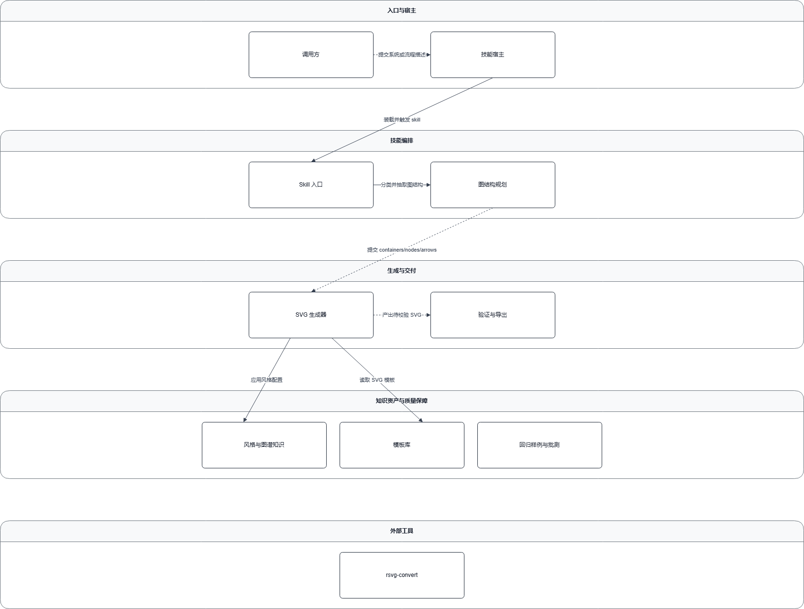

这张图展示的是 `fireworks-tech-graph` 的逻辑视图。它证明系统不是把目录树机械画出来，而是把仓库抽象成入口、编排、生成、模板、规范、校验和导出等稳定职责。

## 适合场景

- 阅读一个陌生仓库，想快速理解它能做什么。
- 给产品、评审或新维护者展示系统结构。
- 梳理模块边界、运行路径和维护影响面。
- 需要可编辑 draw.io 图，而不只是静态截图。

## 处理过程

1. 阅读 README、Skill 说明和关键代码目录。
2. 判断用户真正能感知的能力。
3. 建模用例视图、逻辑视图、开发视图和运行视图。
4. 渲染成 draw.io，并导出 PNG 预览。
5. 标注证据、假设和当前缺口。

## 交付物

| 交付物 | 用途 |
| --- | --- |
| 用例视图 | 给产品或评审看“它能做什么” |
| 逻辑视图 | 给新维护者看“系统由什么组成” |
| 开发视图 | 给工程维护看“改哪里会影响哪里” |
| 运行视图 | 给排障人员看“关键路径怎么流动” |
| `.drawio` 和 PNG | 可编辑交付和文档预览 |

## Case：fireworks-tech-graph

### 用户任务

分析一个“用自然语言生成技术图”的 Skill 仓库，生成完整的 3+1 / 4+1 架构图。

### 输入

- 仓库 README 和 Skill 说明。
- `SKILL.md`。
- `scripts/`、`templates/`、`references/`、`fixtures/`。
- 图生成、校验、导出和回归相关资产。

### 输出

- 用例视图和能力目录。
- 逻辑视图。
- 开发视图。
- 4 条运行路径预览。

### 关键效果

#### 用户能力

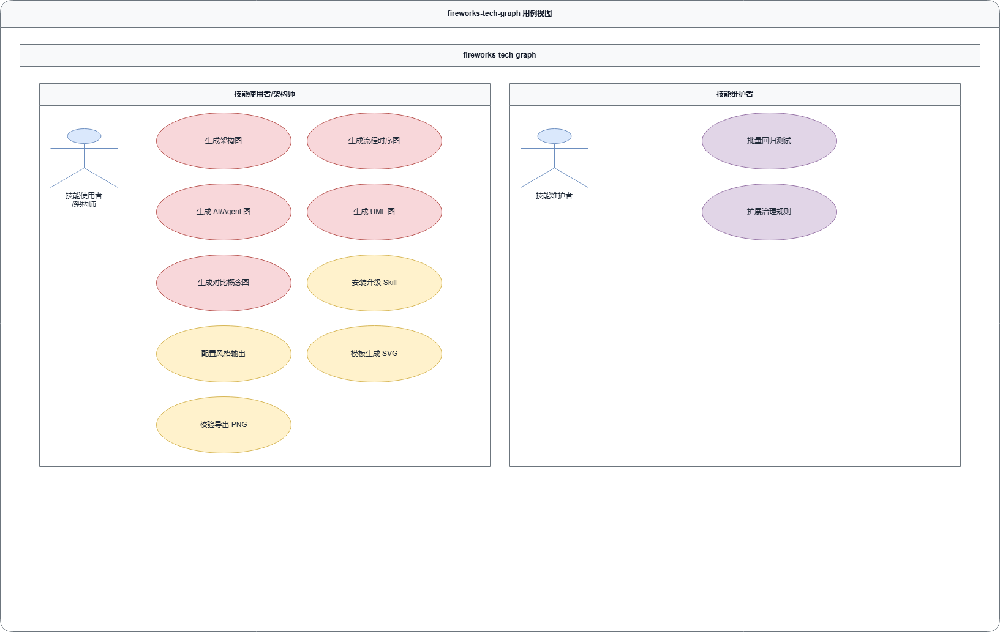

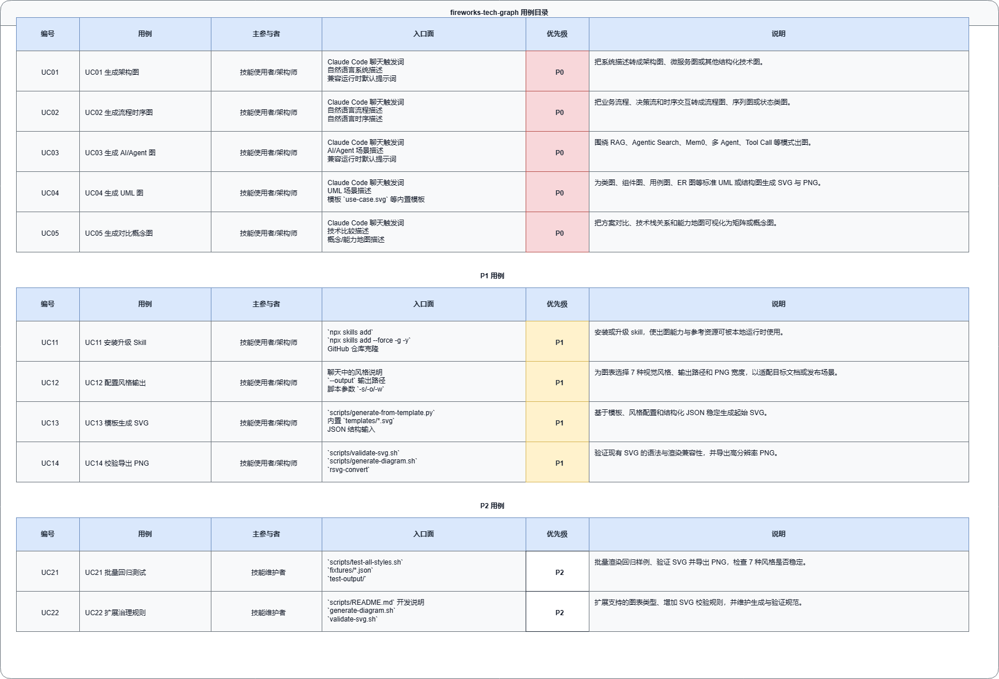

#### 系统职责

#### 代码维护视角

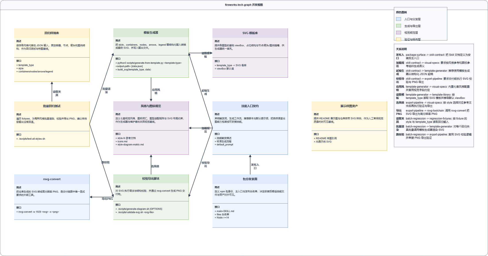

#### 运行路径

用户聊天触发出图：

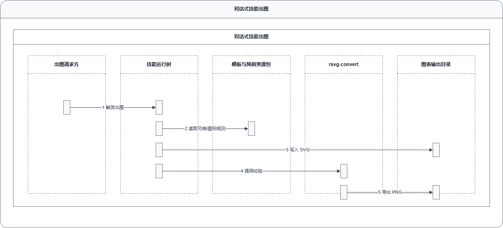

模板化生成 SVG：

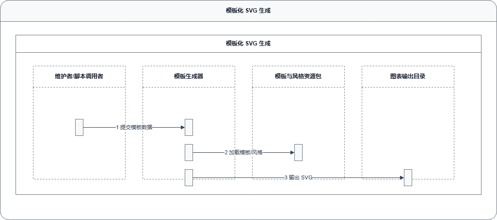

脚本校验并导出 PNG：

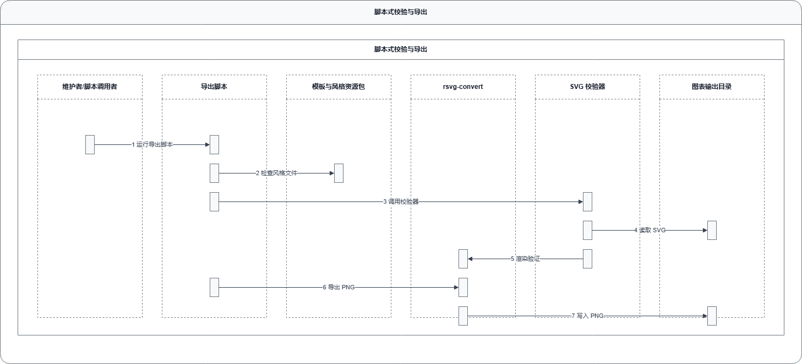

批量回归测试：

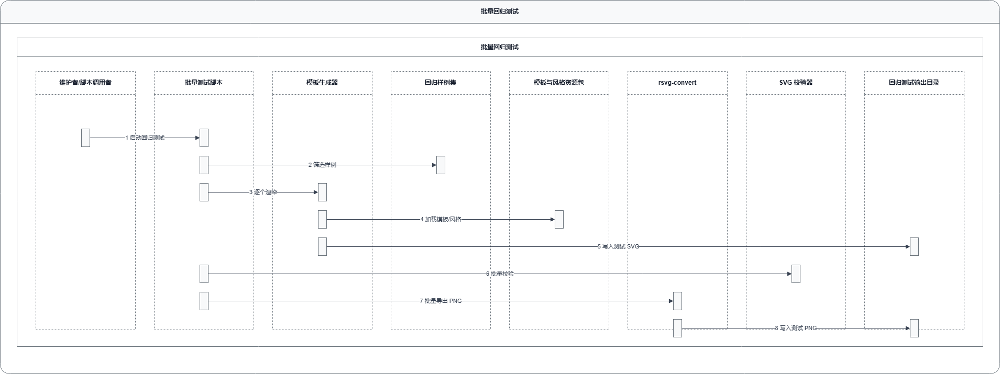

这个案例证明系统能把一个 Skill 仓库拆成用户能力、系统职责、维护边界和运行路径，而不是只画文件夹。

## Case：dynamo-main

### 用户任务

分析一个推理服务相关仓库，展示低延迟推理、分离式推理、KV cache 路由、长上下文卸载、SLA 自动扩缩等能力。

### 输入

- 推理服务仓库。
- 系统入口、调度、缓存和恢复相关代码。
- 运行路径和服务能力材料。

### 输出

- 用户能力视图。
- 逻辑职责视图。
- 开发维护视图。
- 共享缓存、ModelExpress 和 checkpoint 恢复运行路径。

### 关键效果

#### 用户能力

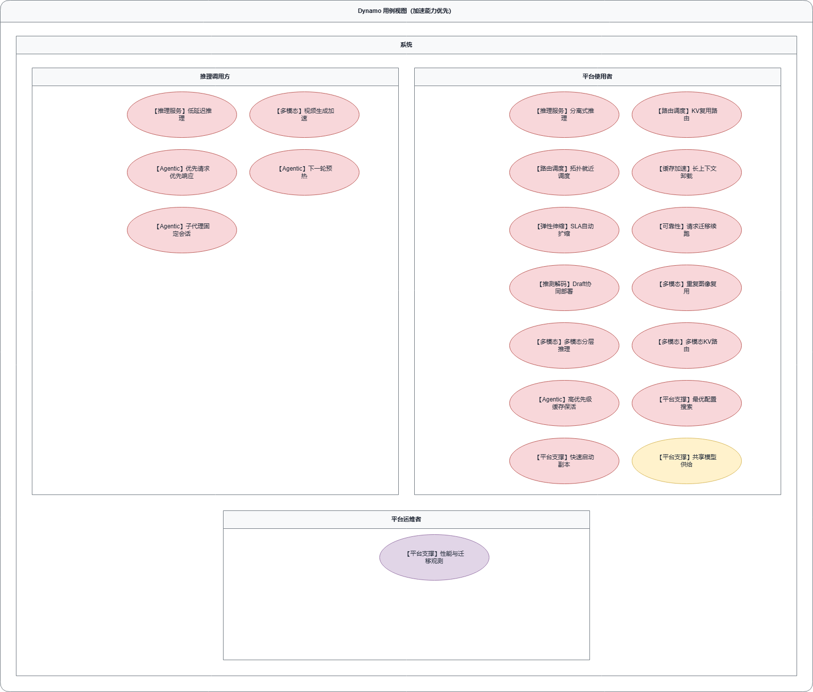

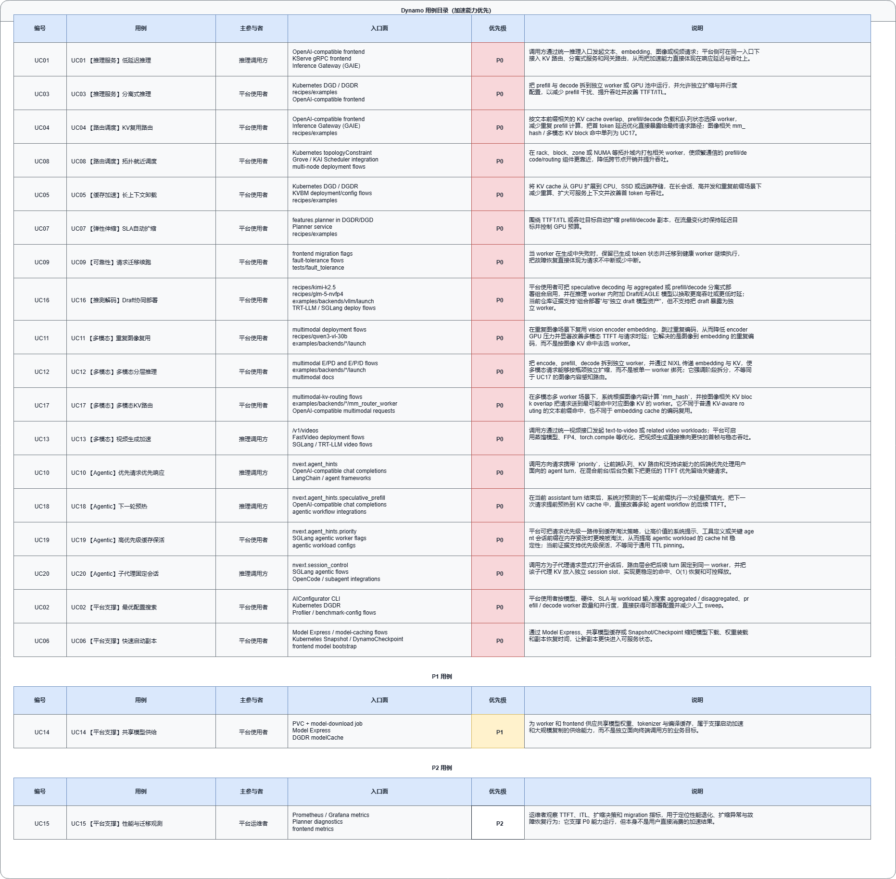

#### 系统职责

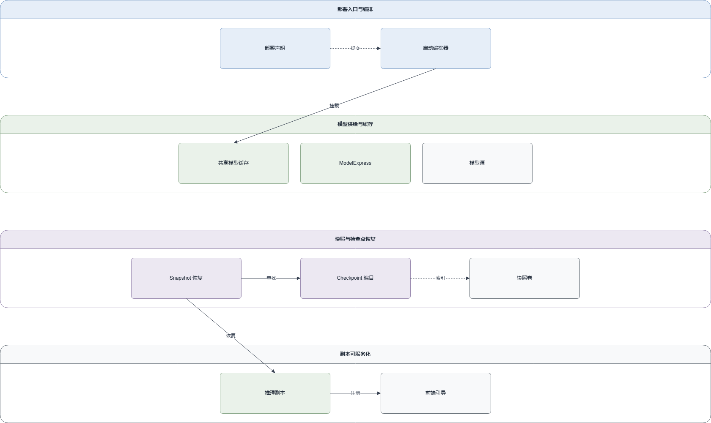

#### 代码维护视角

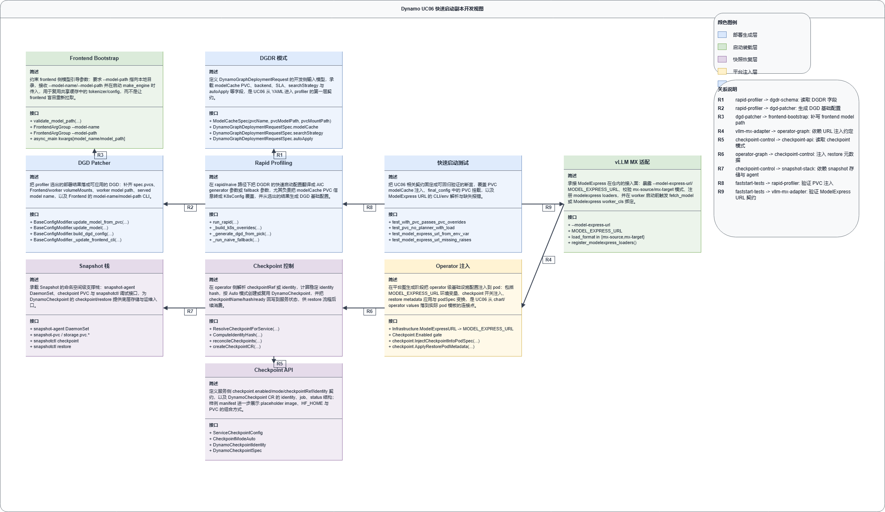

#### 运行路径

共享缓存启动：

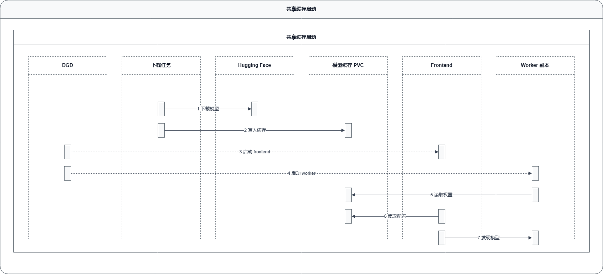

ModelExpress 启动：

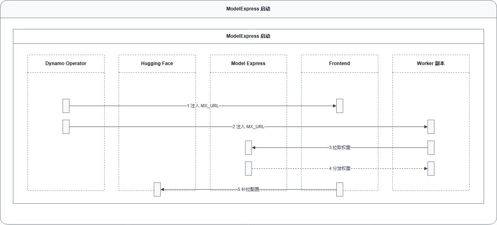

Checkpoint 热恢复：

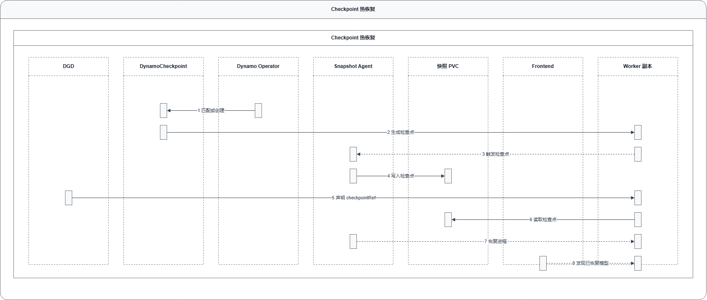

这个案例证明系统能处理复杂工程仓库，并把服务能力、系统职责和运行恢复路径分开表达。

## 展示覆盖

| Case | 输入 | 输出 | 证明的能力 |
| --- | --- | --- | --- |
| fireworks-tech-graph | Skill 仓库 | 3+1 / 4+1 架构视图 | Skill 仓库能力、职责、维护边界和运行路径建模 |
| dynamo-main | 推理服务仓库 | 多视图架构图和运行路径图 | 复杂工程系统的能力与运行链路表达 |

## 当前缺口

当前展示来自历史运行产物，还不是标准化 forward-test case。仓库里还没有 `forward-tests/` 目录，也没有独立的 case prompt、输入清单和 judge rubric。后续补上标准 case 后，应在这里列出每个 case 的输入、输出、效果图和 judge 结论。
