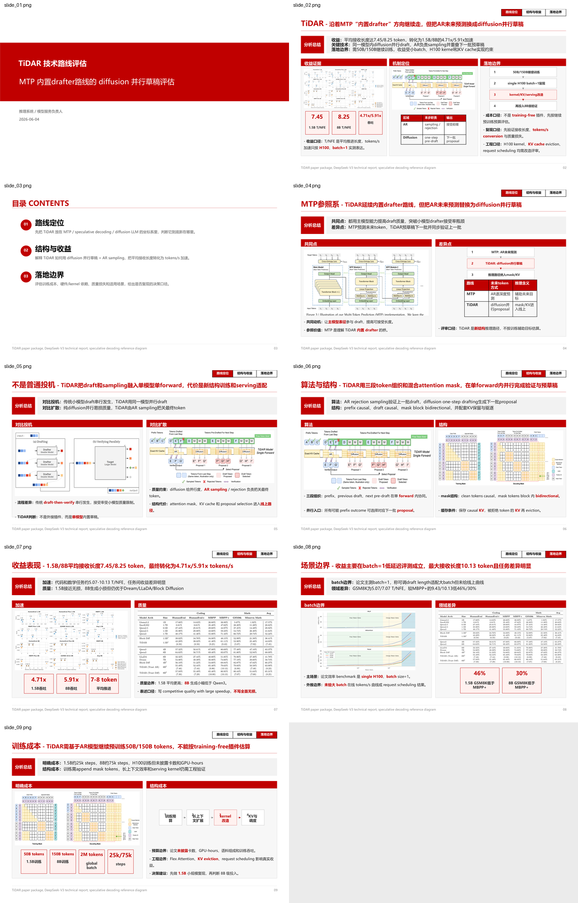

# 能力展示

`huawei-pptx-generator` 把 brief、PDF、Markdown、网页或纯文本材料转成经过 QA 的中文 PPTX 和页面预览图，让技术材料可以直接进入汇报交付。

| 输入 | 输出 | 最关键效果 |
| --- | --- | --- |
| 内容 brief、论文材料、网页材料、目标读者和页数约束 | `.pptx`、页面预览 PNG、视觉/规则 QA 结果 | 复杂材料变成可交付 PPT 页面 |

这张预览证明：系统不是把材料堆成文字页，而是把证据图、页面结论和汇报结构组织成可读的技术 PPT。

## 适合场景

- 把论文或技术材料整理成中文汇报 PPT。
- 根据内容 brief 生成固定页数的技术方案或价值评估。
- 需要保留证据图，并检查文字不要重叠、裁切或失真。
- 需要同时拿到 PPTX 和页面预览图，方便交付前确认。

## 处理过程

1. 读取输入材料和页面约束。
2. 提炼目标读者真正需要的判断。
3. 组织封面、总结、目录和正文页。
4. 为正文页选择证据图和内容布局。
5. 导出 PPTX、页面预览，并运行 QA。

## 交付物

| 交付物 | 用途 |
| --- | --- |
| `.pptx` | 可直接编辑和交付 |
| 页面预览 PNG | 快速检查整体效果 |
| QA 结果 | 检查布局、文字、图片和规则 |

## Case：Aegaeon GPU Pooling 价值评估

### 用户任务

把 Aegaeon 论文讲成 7 页技术价值评估 PPT，帮助 AI 平台和云服务技术负责人判断它是否适合用于模型市场型并发服务。

### 输入

- 已整理好的内容 brief。
- 目标读者、页数、页面标题和每页核心观点。
- 论文图和正文证据。

### 输出

- [Aegaeon PPTX](assets/forward-tests/aegaeon-content-aware-layout-20260604-anchor-memory.pptx)
- [Aegaeon 页面预览](assets/forward-tests/aegaeon-content-aware-layout-20260604-anchor-memory.png)

### 关键效果

这个案例证明系统能把“GPU pooling 为什么有价值”压缩成清晰汇报结构：长尾模型、request-level auto-scaling 局限、token-level scaling 收益和生产部署信号各自落到可读页面。

## Case：TiDAR 技术路线评估

### 用户任务

把 TiDAR 论文讲成 9 页技术路线评估 PPT，说明它和 MTP、speculative decoding、diffusion LLM 的关系，以及落地前需要验证的训练、kernel、KV cache 和 serving 成本。

### 输入

- 内容 brief。
- 论文文本和 PDF/XML 解析结果。
- 补充图片、补充资料和研究审计文件。

### 输出

- [TiDAR PPTX](assets/forward-tests/tidar-evidence-readability-20260604-anchor-memory.pptx)
- [TiDAR 页面预览](assets/forward-tests/tidar-evidence-readability-20260604-anchor-memory.png)

### 关键效果

这个案例证明系统能处理高密度论文材料：优先保留关键证据图，用短句解释每张图支持的判断，并把 TiDAR 表达成需要受控复现的技术路线，而不是低成本插件。

## 展示覆盖

| Case | 输入 | 输出 | 证明的能力 |
| --- | --- | --- | --- |
| Aegaeon GPU Pooling | 内容 brief、论文图 | 7 页 PPTX、页面预览 | 技术价值评估型 PPT 组织 |
| TiDAR 技术路线评估 | brief、PDF/XML、补充资料 | 9 页 PPTX、页面预览 | 高密度论文材料压缩与证据保留 |
