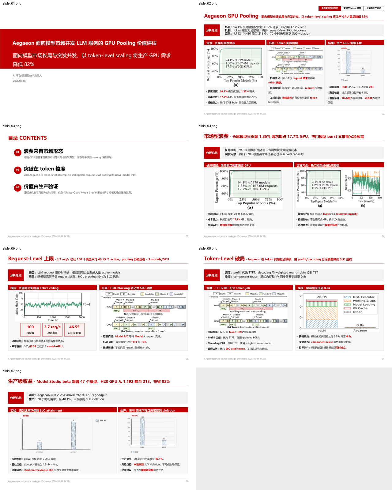

# 能力展示

这里展示的是两份真实风格的 PPT 生成案例。你可以把它理解成：用户给一批材料和一个表达目标，Huawei PPTX Generator 负责读材料、提炼观点、组织页面，并生成一份可以交付的华为风格 PPT。

每个案例都按同一条线讲清楚：为什么要做这份 PPT，生成过程中做了什么，最后交付出来是什么效果。

## 案例一：Aegaeon GPU Pooling 价值评估

### 背景

这个案例要解决的是一个云服务平台负责人会关心的问题：模型市场里有大量长尾模型，也有少数热门模型突然爆发请求，GPU 很容易被低频模型和峰值预留占住。用户希望把 Aegaeon 这篇工作讲成一份 7 页技术价值评估 PPT，让 AI 平台和云服务技术负责人快速判断：它到底能不能降低 GPU 成本，为什么能做到，以及生产环境里有什么证据。

用户给到的材料不是一堆散乱文件，而是一份已经整理好的内容 brief。里面写清楚了主题、目标读者、页数、每页标题、核心观点、正文要点，以及每一页应参考的论文图。

### 过程

生成时，系统先读 brief，确认这份 PPT 应该围绕三件事展开：

- 模型市场为什么会浪费 GPU；
- request-level auto-scaling 为什么不够；
- token-level scaling 如何带来生产侧收益。

然后系统把这些内容组织成封面、顶层总结、目录和 4 页正文。正文页不是简单堆文字，而是把论文图放到页面中心位置，用简洁结论解释图里的业务含义。比如长尾模型分布、active model 上限、token 粒度抢占、生产部署 GPU 节省，都会各自落到清楚的页面结构里。

### 结果

最终生成了一份 7 页 PPTX。整体效果是：页面结构紧凑，证据图可读，结论不是泛泛地说“提升效率”，而是直接服务于平台负责人的判断：Aegaeon 适合用来评估模型市场型并发服务里的 GPU Pooling 价值。

交付件位置：

- PPTX: [aegaeon-content-aware-layout-20260604-anchor-memory.pptx](/skill-static/hw-ppt-gen/assets/forward-tests/aegaeon-content-aware-layout-20260604-anchor-memory.pptx)
- 页面预览: [aegaeon-content-aware-layout-20260604-anchor-memory.png](assets/forward-tests/aegaeon-content-aware-layout-20260604-anchor-memory.png)

## 案例二：TiDAR 技术路线评估

### 背景

这个案例更接近真实论文评审场景。用户想给推理系统和模型服务负责人讲清楚 TiDAR：它和 MTP、speculative decoding、diffusion LLM 有什么关系，收益到底来自哪里，如果要落地，需要付出哪些训练、kernel、KV cache 和 serving 改造成本。

这类材料的难点不是“没有内容”，而是内容太密。输入里有内容 brief、论文文本、PDF/XML 解析结果、补充图片、补充资料和研究审计文件。如果直接把图表塞进固定版式里，PPT 很容易变成一堆看不清的小图。

### 过程

生成时，系统先抓住这份 PPT 的主线：TiDAR 不是一个可以随手外挂的 training-free 插件，而是一条需要继续训练和服务栈适配的新技术路线。

因此页面组织没有只追求“看起来热闹”。系统优先保留关键证据图，让图表有足够空间；再用短句解释每张图支持什么判断。顶层总结页也按用户要求处理：前两栏讲收益和机制，第三栏专门讲落地边界，避免把它画成泛泛的企业部署流程。

### 结果

最终生成了一份 9 页 PPTX。整体效果是：读者能先看到 TiDAR 在技术路线里的位置，再理解它如何把平均接收长度转成吞吐收益，最后看到落地前必须验证的训练成本、H100 batch=1 条件、kernel、KV cache 和 serving 约束。

这份 PPT 的重点不是把论文内容全部塞进去，而是帮技术负责人形成判断：TiDAR 值得关注，但不能当作低成本插件来评估。

交付件位置：

- PPTX: [tidar-evidence-readability-20260604-anchor-memory.pptx](/skill-static/hw-ppt-gen/assets/forward-tests/tidar-evidence-readability-20260604-anchor-memory.pptx)
- 页面预览: [tidar-evidence-readability-20260604-anchor-memory.png](assets/forward-tests/tidar-evidence-readability-20260604-anchor-memory.png)

## 当前展示覆盖

| 案例 | 输出页数 | 展示状态 |
| --- | --- | --- |
| Aegaeon GPU Pooling 价值评估 | 7 页 | 已生成 PPTX 和页面预览 |
| TiDAR 技术路线评估 | 9 页 | 已生成 PPTX 和页面预览 |
